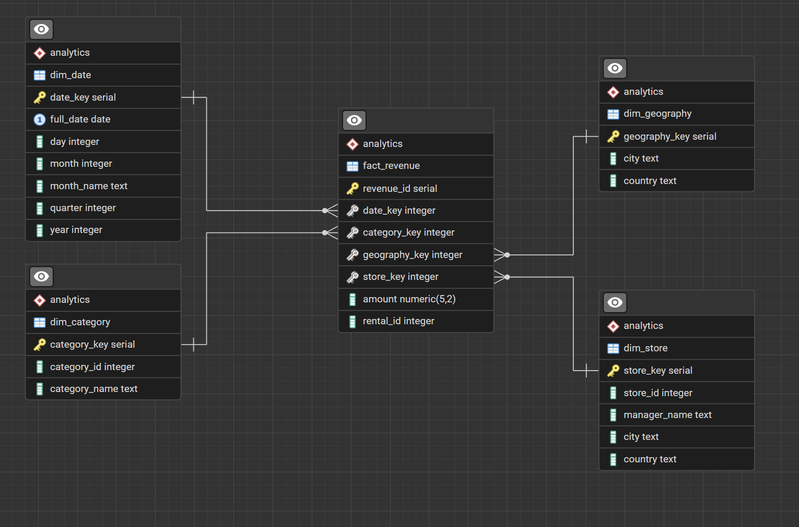
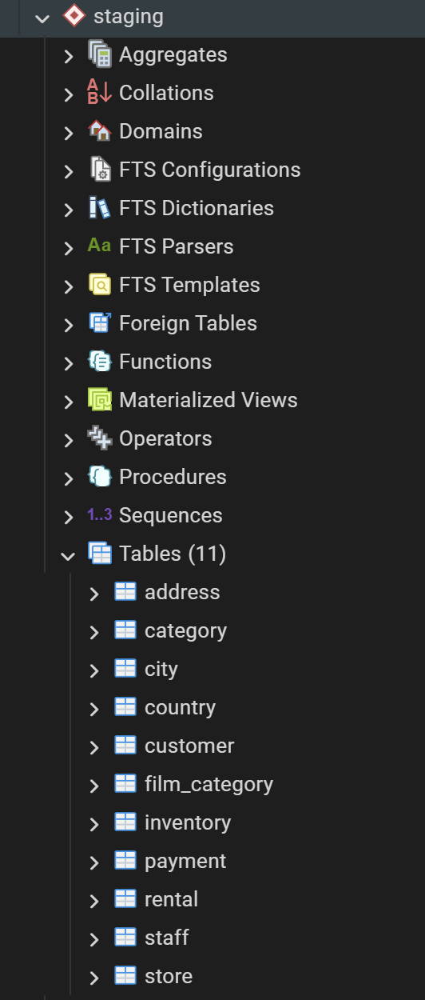
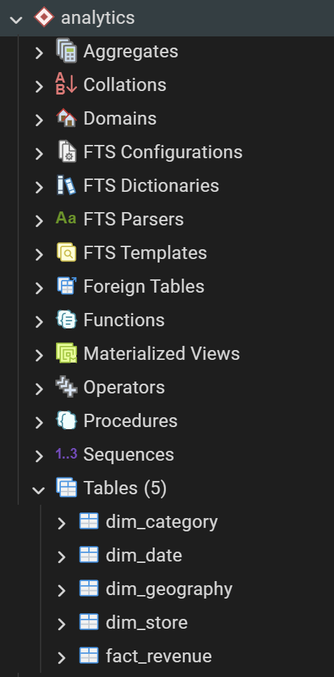
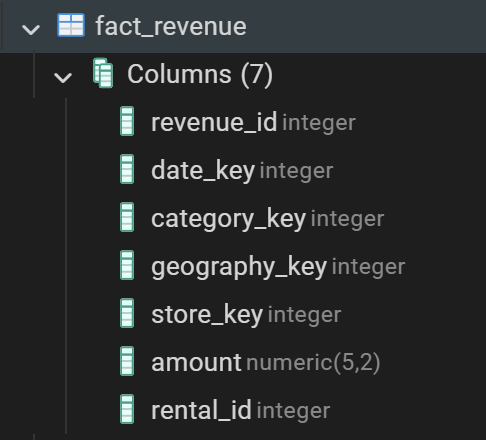
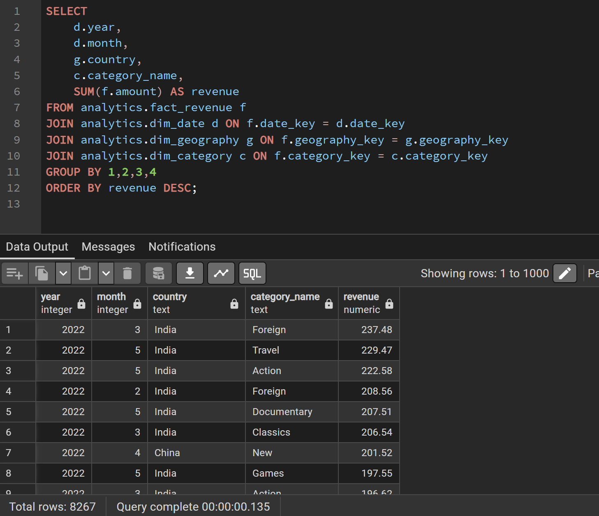

# Pagila Revenue Analytics Data Warehouse

A **data warehousing project** built on the **Pagila** PostgreSQL sample database (a port of the classic Sakila DVD rental database). This repository demonstrates a complete ETL process to transform the transactional source data into a **star schema** optimized for revenue analytics queries.

## Project Overview

The goal is to design a target Star/Snowflake schema to answer the business case:
  Revenue per time unit and geography based on film category.
Design a ttrategy to take the data from source to target, and show the diagram of the complete data pipelie for previous step

The solution follows Kimball dimensional modeling principles:
- **Staging layer** → Raw extracts from source tables
- **Analytics layer** → Star schema with dimension and fact tables

## Architecture



The target model is a classic **star schema**:

- Central fact table: `fact_revenue` (measures: revenue amount, rental count)
- Surrounded by four dimension tables:
  - `dim_date`
  - `dim_category`
  - `dim_geography`
  - `dim_store`

Source ERD (Pagila transactional schema):


## Folder Structure
```text
pagila-revenue-analytics/
├── README.md
├── docs/
│   ├── architecture.md
│   ├── design-decisions.md
│   ├── erd.png
│   └── data-pipeline.png
├── sql/
│   ├── 01_create_schemas.sql
│   ├── 02_staging_extract.sql
│   ├── 03_dim_date.sql
│   ├── 04_dim_category.sql
│   ├── 05_dim_geography.sql
│   ├── 06_dim_store.sql
│   ├── 07_fact_revenue.sql
│   └── 08_validation_queries.sql
└── screenshots/
    ├── pgadmin_staging_tables.png
    ├── pgadmin_dimensions.png
    ├── pgadmin_fact_table.png
    └── pgadmin_query_results.png
```

## How to Run

1. Install PostgreSQL and load the Pagila sample database:  
   git clone https://github.com/devrimgunduz/pagila

2. Open pgAdmin (or psql) and connect to your Pagila database.

3. Execute the SQL scripts in numerical order (01 → 08).

4. Explore the results in the `analytics` schema.

## Sample Analytics Queries

See `sql/08_validation_queries.sql` for examples:
- Total revenue
- Revenue by year
- Revenue by category
- Revenue by country

## Screenshots

- Staging tables  
  

- Dimension tables  
  

- Fact table preview  
  

- Query results example  
  

